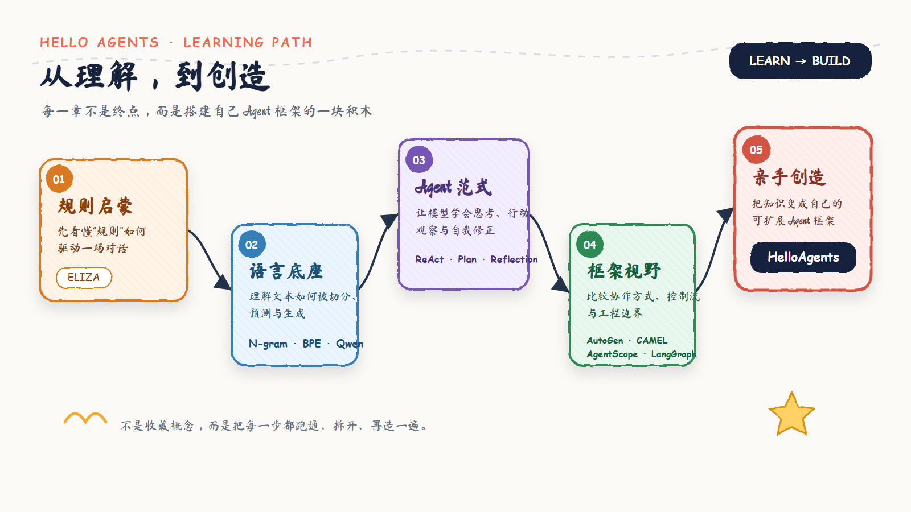
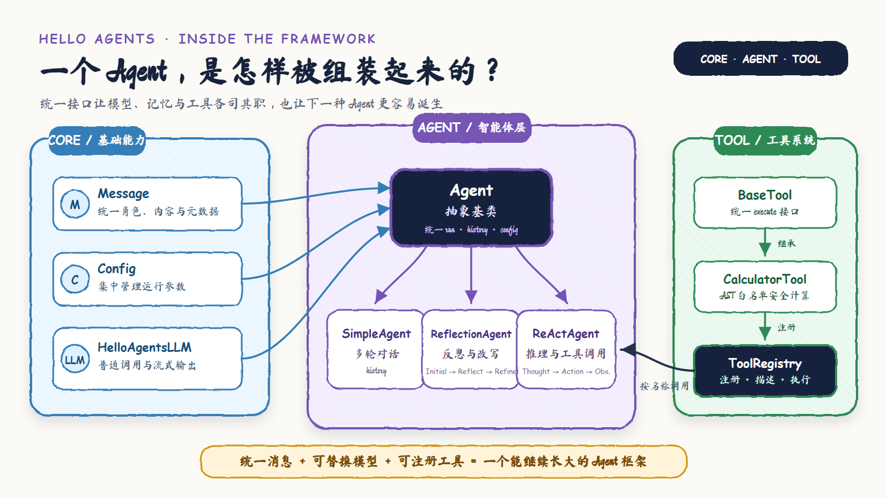

<div align="center">

# Hello Agents · 我的智能体学习实验室

**从“Agent 到底是什么”出发，用代码和笔记，一步步把它拆开、跑通、再亲手搭起来。**

规则对话 → 语言模型 → Agent 工作流 → 多智能体协作 → 自制 HelloAgents

[](https://www.python.org/)
[](https://docs.astral.sh/uv/)
[](./notes/README.md)
[](https://github.com/lizhuofan-curry/hello-agents-learning-lab/discussions)

</div>

---

## 为什么有这个仓库

我想把学习 Agent 的过程留得更具体一些：不只记录“调用了哪个框架”，还追问模型如何决定下一步、工具调用是怎样接上的、计划失败时会发生什么。这里既有从零写的小实验，也有我对概念、课后题和失败边界的中文笔记。

如果你也刚开始学 AI Agent，可以从第一章顺着走；如果你已经在写 Agent，可以直接跳到[第七章的自制框架](./第七章/README.md)，看一个 Agent 怎样从消息、模型和工具逐层长出来。

> 这是持续更新的个人学习实验室，不是官方教程，也不把尚未实现的能力标成“已完成”。

## 从哪里开始

| 我想了解…… | 推荐入口 | 可以看到什么 |
|---|---|---|
| Agent 的第一个闭环 | [第一章](./第一章/README.md) | 旅行助手里的 Thought → Action → Observation |
| 不用大模型如何“聊天” | [第二章](./第二章/README.md) | ELIZA 的规则匹配、代词转换与增强版 |
| LLM 为何能接续文本 | [第三章](./第三章/README.md) | Bigram、BPE、Qwen 推理与 KV Cache |
| Agent 如何组织思考与行动 | [第四章](./第四章/README.md) | ReAct、Plan-and-Solve、Reflection 三种范式 |
| 多个 Agent 如何协作 | [第六章](./第六章/README.md) | AutoGen、AgentScope、CAMEL、LangGraph 实验 |
| 如何做自己的 Agent 框架 | [第七章](./第七章/README.md) | HelloAgents 的 Core、Agent、Tool、Function Calling |

第五章目前没有对应的项目目录，先如实保留空白；后续整理完成再补。

## 学习地图

<p align="center">
  <a href="./assets/learning-roadmap.svg">
    
  </a>
</p>
<p align="center"><sub>点击图片可查看 SVG 原图；每章的具体文件与运行方式见上方入口。</sub></p>

## 当前重点：自制 HelloAgents

第七章是这段学习路线的“回收站”与“试验台”：前面学过的消息、工具、规划和反思，在这里变成能复用的 Python 组件。它有独立的 `pyproject.toml`、`uv.lock` 和 **24 个演示脚本**，无需把前面几章的框架依赖一起装进来。

<p align="center">
  <a href="./assets/helloagents-architecture.svg">
    
  </a>
</p>
<p align="center"><sub>这张图展示最初搭建的基础骨架；下表补充之后新增的 Plan-and-Solve 与 Function Calling。</sub></p>

| 层次 | 已实现内容 | 从哪里读起 |
|---|---|---|
| Core | `Message`、`Config`、`HelloAgentsLLM`、`Agent` 抽象基类 | [core](./第七章/HelloAgents/hello_agents/core/) |
| Tools | `BaseTool`、`ToolParameter`、`ToolRegistry`、受限表达式计算器、OpenAI 工具 Schema 转换 | [tools](./第七章/HelloAgents/hello_agents/tools/) |
| 基础 Agent | `SimpleAgent` 的对话历史；`ReActAgent` 的工具选择、Observation 与最大步数 | [agents](./第七章/HelloAgents/hello_agents/agents/) |
| 规划与反思 | `PlanAndSolveAgent` 的计划生成与逐步执行；`ReflectionAgent` 的初稿、一次反馈与按需改写 | [演示索引](./第七章/HelloAgents/README.md#演示怎么选) |
| 原生工具调用 | `FunctionCallAgent` 的工具 Schema、参数解析/转换、工具执行与结果回填 | [演示索引](./第七章/HelloAgents/README.md#演示怎么选) |

这里有意保留实现边界：`ReflectionAgent` 只做**一轮**反思；`PlanAndSolveAgent` 当前按初始计划依次执行，**不动态重规划**；`FunctionCallAgent` 当前处理一次模型发起的工具调用并请求最终答复，**还不是多轮工具循环**，且工具执行适配层目前只支持单参数工具。把边界说清楚，才方便下一步真正改进。

## 5 分钟试跑：先看不需要 API 的部分

先安装 [uv](https://docs.astral.sh/uv/getting-started/installation/) 和 Python 3.11 或 3.12。在仓库根目录打开 PowerShell：

```powershell
cd ".\第七章\HelloAgents"
uv sync

# Windows 中文终端输出乱码时可开启
$env:PYTHONUTF8 = "1"

uv run python -m demos.demo_message
uv run python -m demos.demo_calculator
uv run python -m demos.demo_tool_schema
```

这三个演示依次展示：消息怎样表示、工具怎样执行、工具说明如何转换成 Function Calling Schema。它们不需要模型密钥，也不会发起模型调用。

想看完整的 Agent 流程，再配置 OpenAI 兼容服务：

```powershell
# 仍在第七章/HelloAgents 目录
Copy-Item ".\..\..\.env.example" ".\.env"
# 编辑 .env，填写 LLM_API_KEY、LLM_MODEL_ID、LLM_BASE_URL

uv run python -m demos.demo_react
uv run python -m demos.demo_plan_solve_v2
uv run python -m demos.demo_reflection
uv run python -m demos.demo_function_call_agent_run
```

模型服务必须支持对应示例的接口；最后一个演示尤其需要服务支持原生 `tools` / Function Calling。各演示的定位、是否需要 API 和建议阅读顺序，见[第七章项目说明](./第七章/HelloAgents/README.md)。

## 其他章节怎样运行

仓库根目录的 uv 项目按主题划分依赖，避免把 PyTorch 和多个 Agent 框架一次性装齐。进入仓库根目录后，选择一个分组运行；下面用第一章举例：

```powershell
Copy-Item .env.example .env
uv sync --group chapter1
uv run --group chapter1 python ".\第一章\动手体验：5分钟实现第一个智能体.py"
```

| 章节 / 框架 | uv 分组 | 入口 |
|---|---|---|
| 第一章 | `chapter1` | [旅行助手](./第一章/README.md) |
| 第二章 | 无额外分组，使用 Python 标准库 | [ELIZA](./第二章/README.md) |
| 第三章 | `chapter3`（N-gram、BPE 小实验只用标准库） | [语言模型实验](./第三章/README.md) |
| 第四章 | `chapter4` | [工作流范式](./第四章/README.md) |
| 第六章 AutoGen | `autogen` | [多智能体实验](./第六章/README.md) |
| 第六章 AgentScope | `agentscope` | [多智能体实验](./第六章/README.md) |
| 第六章 CAMEL | `camel` | [多智能体实验](./第六章/README.md) |
| 第六章 LangGraph | `langgraph` | [多智能体实验](./第六章/README.md) |
| 第七章 HelloAgents | 独立 uv 项目 | [框架与演示](./第七章/HelloAgents/README.md) |

运行其他分组时，把 `chapter1` 换成表中的分组；具体脚本路径和注意事项写在各章 README。第七章请进入自己的项目目录后再执行 `uv sync`。

## 笔记也是项目的一部分

我把课后题、概念推导和框架比较放在 [中文学习笔记目录](./notes/README.md)，目前对应第一、二、三、四、六章。比如第一章讨论智能体闭环与循环上限，第三章从 Bigram 一直追到 Transformer、幻觉与 RAG，第四章比较三种工作流，第六章关注多智能体的协作与质量控制。笔记是个人理解与练习，欢迎指出错误；第七章目前以代码注释和演示记录为主。

## 配置、安全与成本

`.env.example` 只放变量名和占位值；真实的 `.env` 在忽略列表中。不同示例按需填写：`LLM_API_KEY`、`LLM_MODEL_ID`、`LLM_BASE_URL`（模型服务），`TAVILY_API_KEY`、`SERPAPI_API_KEY`（搜索），以及可选的 `QWEN_CACHE_DIR`（本地模型缓存）。不要把密钥粘贴到 Issue、Discussion 或截图里。

有些实验会下载模型，或访问外部模型、搜索、天气服务，可能需要网络、显存、账户额度并产生费用；运行前请先看对应章节说明。示例输出需要人工核对，不用于医疗、法律、金融等高风险决策。

## 一起把问题聊明白

欢迎到 [Discussions](https://github.com/lizhuofan-curry/hello-agents-learning-lab/discussions) 提问、纠错、分享复现过程。你可以直接贴“输入是什么、预期是什么、实际输出是什么”；也可以聊为什么一次反思还不够、Function Calling 何时该继续调用工具、不同框架会如何处理同一个任务。这个仓库的重点不是展示一个完美答案，而是把“逐渐弄懂”的过程留给下一个学习者。

## 致谢与范围

本仓库是个人学习与实验记录，非官方实现。学习路线与部分练习参考 Datawhale 开源教程 [Hello-Agents](https://github.com/datawhalechina/hello-agents)，感谢原项目和各框架贡献者。复用第三方代码、模型及服务时，请遵守各自许可证与条款。
