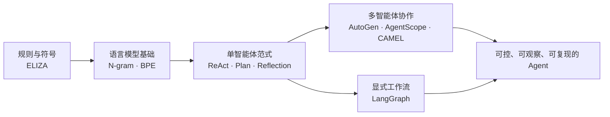

<div align="center">

# Hello Agents · 我的智能体学习实验室

**把“看懂 Agent”变成“亲手跑通 Agent”。**

从 ELIZA、N-gram 和 BPE 出发，一路走到 ReAct、Plan-and-Solve、Reflection，
再进入 AutoGen、AgentScope、CAMEL 与 LangGraph 的多智能体世界。

[](https://www.python.org/)
[](https://docs.astral.sh/uv/)
[](./notes/README.md)
[](https://github.com/lizhuofan-curry/hello-agents-learning-lab/discussions)

</div>

---

## 这里有什么

这不是一份只收藏链接的资料清单，而是我的 AI Agent 学习现场：每个概念都尽量配上可以运行、可以观察、可以继续改造的 Python 代码，同时保留我在学习过程中真正遇到的问题、推导和思考。

| 路线 | 主题 | 代码 | 学习笔记 |
|---|---|---|---|
| 第一章 | 第一个工具调用智能体、Thought–Action–Observation 闭环 | [进入代码](./第一章/) | [第一章课后习题](./notes/第一章/第一章的问题.md) |
| 第二章 | ELIZA、规则匹配与短期记忆 | [进入代码](./第二章/) | [第二章课后习题](./notes/第二章/第二章的问题.md) |
| 第三章 | N-gram、BPE、Qwen 本地推理与 KV Cache | [进入代码](./第三章/) | [第三章课后习题](./notes/第三章/第三章的问题.md) |
| 第四章 | ReAct、Plan-and-Solve、Reflection | [进入代码](./第四章/) | [第四章课后习题](./notes/第四章/第四章的问题.md) |
| 第六章 | AutoGen、AgentScope、CAMEL、LangGraph | [进入代码](./第六章/) | [第六章课后习题](./notes/第六章/第六章的问题.md) |

> 第五章内容仍在学习与整理中。这里保留真实进度，不用“看起来完整”代替“真正理解”。

## 学习地图



## 用 uv 开始

本仓库使用 [uv](https://docs.astral.sh/uv/) 管理 Python 版本、虚拟环境和依赖。不同章节依赖差异较大，因此按主题分组安装，避免一次装下所有框架。

```powershell
# 1. 克隆后进入项目
cd hello-agents-learning-lab

# 2. 创建本地配置（真实密钥只放在 .env，绝不要提交）
Copy-Item .env.example .env

# 3. 按你要学习的章节同步依赖
uv sync --group chapter1

# 4. 通过 uv 运行示例
uv run python ".\第一章\动手体验：5分钟实现第一个智能体.py"
```

可用环境分组：

| 分组 | 安装命令 | 对应内容 |
|---|---|---|
| `chapter1` | `uv sync --group chapter1` | 第一个联网工具智能体 |
| `chapter3` | `uv sync --group chapter3` | PyTorch、Transformers、Qwen |
| `chapter4` | `uv sync --group chapter4` | ReAct、Plan-and-Solve、Reflection |
| `autogen` | `uv sync --group autogen` | AutoGen 0.7.4 案例 |
| `agentscope` | `uv sync --group agentscope` | AgentScope 1.0.2 案例 |
| `camel` | `uv sync --group camel` | CAMEL 案例 |
| `langgraph` | `uv sync --group langgraph` | LangGraph 案例 |

切换主题时再次执行对应的 `uv sync --group ...` 即可。模型和框架之间可能存在版本差异；如果你希望完全隔离某个大型实验，也可以在对应子目录单独建立 uv 项目。

## 配置说明

复制 `.env.example` 为 `.env` 后，按示例需要填写：

- `LLM_API_KEY`、`LLM_MODEL_ID`、`LLM_BASE_URL`：OpenAI 兼容模型服务；
- `TAVILY_API_KEY`：Tavily 搜索；
- `SERPAPI_API_KEY`：SerpAPI 搜索；
- `QWEN_CACHE_DIR`：可选，本地 Hugging Face 模型缓存目录。

`.env` 已加入 `.gitignore`。仓库中的示例不会保存真实密钥。

## 我想在这里记录什么

- 不只记录“最后能跑”，也记录变量怎么变化、Agent 为什么做出下一步决策；
- 不只比较框架名字，也比较协作模式、控制方式、失败路径和适用边界；
- 保留初学时真实的问题，让后来者可以沿着同一条路径少绕一点弯；
- 把代码、笔记和实验结果放在一起，让每个结论都能找到来源。

## 一起讨论

欢迎到 [Discussions](https://github.com/lizhuofan-curry/hello-agents-learning-lab/discussions) 交流：

- 你最想看哪个示例被拆成逐行运行流程？
- 某个 Agent 为什么会循环、跑题或调用错工具？
- 同一个任务更适合 ReAct、Reflection，还是 LangGraph？
- 你有更清晰的实现方式或实验结果吗？

问题、纠错和学习心得都很欢迎。这个仓库的目标不是假装无所不知，而是把“逐渐弄懂”的过程认真留下来。

## 说明与致谢

本仓库是个人学习与实验记录，并非官方实现。学习路线与部分练习参考了 Datawhale 的开源教程 [Hello-Agents](https://github.com/datawhalechina/hello-agents)，感谢原项目贡献者。引用或复用代码、模型与第三方框架时，请同时遵守对应上游项目的许可证与使用条款。

部分示例会访问第三方模型、搜索或天气服务，可能产生费用、限流或网络风险；运行前请检查服务条款和账户额度。所有输出都应经过人工核验，不应直接用于医疗、法律、金融等高风险决策。
