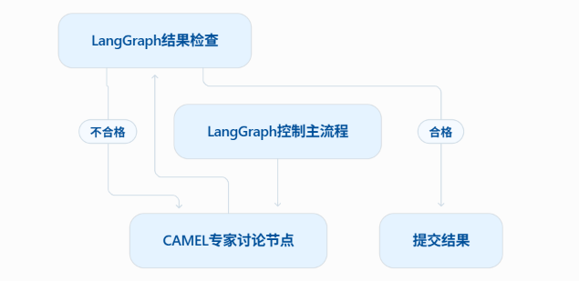
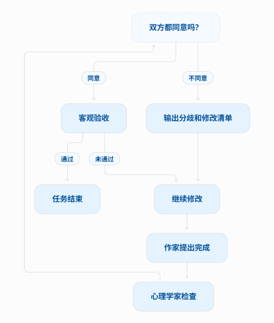
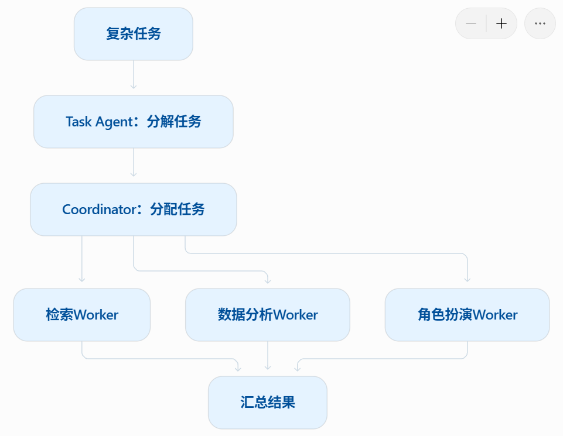
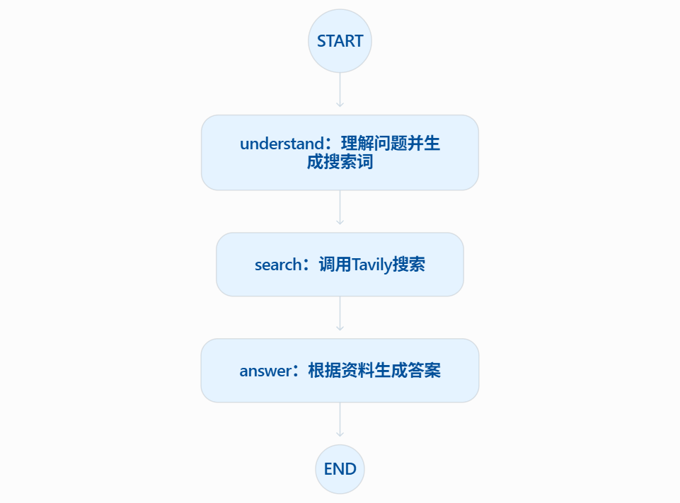
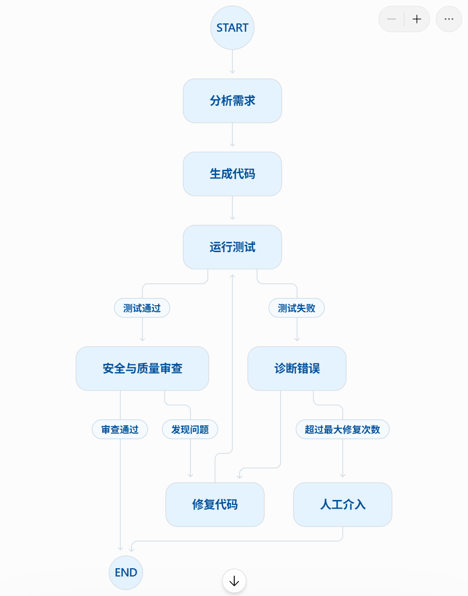

# 第六章课后习题

## 习题1

本章介绍了四个各具特色的智能体框架：`AutoGen`、`AgentScope`、`CAMEL` 和 `LangGraph`。请分析：

- 在6.1.2节的表6.1中，对比了这四个框架的多个维度。请选择其中两个你最熟悉的框架，从"协作模式"、"控制方式"、"适用场景"三个维度进一步深入对比。
- 本章提到了"涌现式协作"与"显式控制"之间的权衡，如何理解这两种设计哲学的含义。

### AutoGen 与 LangGraph 深入对比

这两个框架最能体现教材中“涌现式协作”和“显示控制”的区别

| 对比维度 | AutoGen                                | LangGraph                                  |
| -------- | -------------------------------------- | ------------------------------------------ |
| 协作模式 | 多个不同角色通过对话协作               | 节点通过共享状态协作                       |
| 控制方式 | 通过角色提示词、发言规则、终止条件控制 | 通过节点、边、条件边和循环显式控制         |
| 执行过程 | 谁发言、说什么，具有一定自主性         | 下一步执行哪个节点，由程序条件决定         |
| 适用场景 | 软件团队、头脑风暴、角色讨论、方案评审 | 审批流程、搜索助手、反思修改、代码测试修复 |
| 主要优势 | 角色自然，容易模拟真实团队             | 路径清楚、可预测、可调试、可审计           |
| 主要问题 | 可能跑题、重复讨论或陷入循环           | 需要编写较多流程代码，灵活性相对低         |

例如之前运行的 AutoGen 软件开发团队：

```
产品经理 → 工程师 → 代码审查员 → 用户代理
```

表面上看也像一个流程，但每个智能体输出的内容主要由模型自己决定。而LangGraph 会把它写成明确的图，这里“通过之后去哪，不通过后去哪”是程序明确规定的。

**如何理解“涌现式协作”**

涌现式协作是指：

> 开发者只定义智能体的角色，目标和基本规则，具体协作过程由大模型根据对话自主产生

例如在 CAMEL 中：

- 心理学家负责专业知识
- 作家负责内容表达
- 两者共同完成一本心理学电子书

开发者没有提前写死：

```
第1轮必须讨论第一章
第2轮必须检查科学依据
第3轮必须修改案例
```

而是让两个智能体根据上下文自主决定下一轮讨论什么，它的优点是：

- 灵活
- 适合开放式问题
- 有时会产生开发者没预先想到的方案
- 比较接近真实人类团队的交流

缺点是：

- 结果不完全可预测
- 可能偏离任务
- 可能反复讨论同一个问题
- 难以保证每次都按照同样的流程运行

**如何理解“显示控制”**

显示控制是指：

> 开发者提前定义智能体允许执行的步骤，步骤之间的关系以及跳转条件

例如 LangGraph 的搜索助手：
```
理解问题 → 搜索资料 → 生成答案
```

如果加入反思则变成：

```
生成答案 → 质量检查
              ├─ 合格 → 结束
              └─ 不合格 → 重新搜索
```

它的优点是：

- 每一步都能追踪
- 跳转路径明确
- 容易加入超时，重试和人工审核
- 适合可靠性要求高的系统

缺点是：

- 开发者需要提前考虑大量分支
- 代码量更大
- 对未知情况的适应能力不如开放式讨论

### 这两种思想并不冲突

真实系统通常会结合两者：


LangGraph 负责保证流程稳定，CAMEL 或 AutoGen 负责在某个节点内部展开开放讨论

## 习题2

在6.2节的 `AutoGen` 案例中，我们构建了一个"软件开发团队"。请基于此案例进行扩展思考：

> **提示**：这是一道动手实践题，建议实际操作

- 当前的团队使用 `RoundRobinGroupChat`（轮询群聊）模式，智能体按固定顺序发言。如果需求变更，工程师的代码需要返回给产品经理重新审核，应该如何修改协作流程？请设计一个支持"动态回退"的机制。
- 在案例中，我们通过 `System Message` 为每个智能体定义了角色和职责。请尝试为这个团队添加一个新角色"测试工程师"（`Quality Assurance`），并设计其系统消息，使其能够在代码审查后执行自动化测试。
- `AutoGen` 的对话式协作存在可能的不稳定性，可能导致对话偏离主题或陷入循环。请思考：如何设计一套"对话质量监控"机制，在检测到异常时及时干预？

### 设计支持“动态回退”的机制

原来的 RoundRobinGroupChat 是固定轮询：

```
产品经理 → 工程师 → 审查员 → 用户代理 → 产品经理……
```

它的问题是：无论代码出了什么问题，都只能按照固定顺序继续发言，但是代码审查可能产生不同结果：

1. 代码实现有问题：退回工程师
2. 工程师误解需求：退回产品经理
3. 代码通过：进入测试工程师
4. 测试失败：退回工程师
5. 测试成功：结束

所以要从“固定轮询”改成“根据状态动态选择下一名智能体”

**第一步：让审查员输出结构化结果**

不能让审查员只输出一段自然语言，例如：

```
代码总体还行，但是有一些问题……
```

因为这样程序很难判断下一步去哪

可以定义：
```python
from typing import Literal
from pydantic import BaseModel, Field


class ReviewResult(BaseModel):
    decision: Literal[
        "pass",
        "revise_code",
        "recheck_requirement"
    ]

    reason: str

    issues: list[str] = Field(default_factory=list)
```

审查结果示例：

```python
ReviewResult(
    decision="revise_code",
    reason="API请求没有设置超时",
    issues=[
        "requests.get没有timeout参数",
        "没有处理网络异常"
    ]
)
```

**第二步：根据结果路由**

```python
def route_after_review(result: ReviewResult) -> str:
    if result.decision == "pass":
        return "QualityAssurance"

    if result.decision == "recheck_requirement":
        return "ProductManager"

    return "Engineer"
```

这样就实现了：

```
pass                 → 测试工程师
revise_code          → 工程师
recheck_requirement  → 产品经理
```

**第三步：限制回退次数**

如果没有限制，可能出现：

```
工程师 → 审查员 → 工程师 → 审查员……
```

因此需要增加：
```python
MAX_RETRY = 3
```

每次退回：

```python
retry_count += 1

if retry_count > MAX_RETRY:
    next_agent = "HumanReviewer"
```

也就是：自动修复最多尝试3次，仍然无法解决就交给人类

###  添加测试工程师 Quality Assurance

测试工程师应放在代码审查之后。它的职责不是重新写代码，而是：

- 根据验收标准设计测试
- 运行正常测试
- 运行边界测试
- 运行异常测试
- 判断能否交付

可以这样定义：
```python
def create_quality_assurance(model_client):
    system_message = """
你是一名严谨的软件测试工程师（Quality Assurance）。

你的主要职责是：

1. 阅读产品需求、验收标准和待测试代码；
2. 设计正常情况、边界情况和异常情况测试；
3. 在代码执行环境中运行测试；
4. 根据真实测试结果判断代码是否可以交付；
5. 如果测试失败，提供复现步骤和错误原因。

输出要求：

一、测试计划
- 测试目标
- 测试环境
- 测试用例

二、测试结果
- 测试总数
- 通过数量
- 失败数量
- 错误日志

三、最终结论
- 全部关键测试通过：输出 TEST_PASS
- 发现代码缺陷：输出 TEST_FAIL_CODE
- 需求不明确：输出 TEST_BLOCKED_REQUIREMENT

注意：
不得伪造测试结果。
没有真实执行证据时，不得声称测试通过。
"""

    return AssistantAgent(
        name="QualityAssurance",
        model_client=model_client,
        system_message=system_message,
    )
```

这里有一个非常重要的设计：

> QA智能体负责设计测试和分析结果，代码执行器负责真正运行测试

也就是把“语言推理”和“真实执行”分开，否则大模型可能只是文字上说“测试通过”，实际上根本没有运行代码

### 设计“对话质量监控”机制

可以增加一个 ConverationMonitor ,它不参与软件开发，而是监控整个团队，主要检测一下问题：

| 异常情况 | 检测方法                       | 处理方式             |
| -------- | ------------------------------ | -------------------- |
| 对话跑题 | 回复与任务的语义相关度过低     | 重新注入任务目标     |
| 内容重复 | 连续几轮内容高度相似           | 要求提供新证据或停止 |
| 陷入循环 | 相同角色跳转模式重复出现       | 超过次数后人工介入   |
| 没有进展 | 代码、测试结果和状态长时间不变 | 重新制定计划         |
| 虚假执行 | 声称测试成功，但没有执行日志   | 拒绝通过             |
| 成本过高 | Token、轮数、时间超过预算      | 压缩上下文或终止     |
| 输出异常 | 没有按照结构化格式输出         | 要求重新生成         |

可以维护一个状态：

```python
class MonitorState(BaseModel):
    round_count: int = 0
    repeated_count: int = 0
    rollback_count: int = 0
    total_tokens: int = 0
    elapsed_seconds: float = 0
    last_code_hash: str | None = None
    last_test_result: str | None = None
```

监控逻辑：

```python
def should_intervene(state: MonitorState) -> bool:
    if state.round_count > 20:
        return True

    if state.repeated_count >= 3:
        return True

    if state.rollback_count > 3:
        return True

    if state.elapsed_seconds > 600:
        return True

    return False
```

最可靠的方案是三级监控：

1. 确定性规则：次数，超时，退出码，格式验证
2. LLM 评审：判断是否跑题，是否有新进展
3. 人工兜底：高风险或者多次失败时介入

不能只让另一个大模型负责监控，否则“监控模型”本身也可能判断错误

## 习题3

在6.3节的 `AgentScope` 案例中，我们实现了一个"三国狼人杀"游戏。请深入分析：

- 案例中使用了 `MsgHub`（消息中心）来管理智能体间的通信。请解释消息驱动架构相比传统函数调用的优势是什么？在什么场景下这种架构特别有价值？
- 游戏中使用了结构化输出（如 `DiscussionModelCN`、`WitchActionModelCN`）来约束智能体行为。请设计一个新的游戏角色"猎人"，并定义其对应的结构化输出模型，包括字段定义和验证规则。
- `AgentScope` 支持分布式部署，这意味着不同的智能体可以运行在不同的服务器上。请思考：在"三国狼人杀"这样的实时游戏场景中，分布式部署会带来哪些技术挑战？如何保证消息的顺序性和一致性？

### 消息驱动架构的优势

传统函数调用的是：

```python
result = agent_b.respond(message)
```

这意味着：

- A必须知道B
- A需要知道B的调用接口
- A通常需要等待B执行完成
- 新增角色可能需要修改原有代码

消息驱动方式是：

```
玩家A → MsgHub → 玩家B、玩家C、裁判、观察员
```

这样发送者只负责发送信息，不需要知道所有接收者

**主要优势** 

1. **降低耦合**

   刘备只需要把消息发给消息中心，不必直接调用：

   ```python
   caocao.reply()
   zhugeliang.reply()
   referee.record()
   ```

   新增观察员时，也不需要修改刘备的代码

2. **支持一对多广播**

   狼人杀中，一位玩家公开发言后，其他所有玩家都应该收到。

   消息中心可以一次广播：

   ```
   刘备发言 → 所有存活玩家
   ```

3. **支持异步执行**

   多个智能体可以在不同线程，进程甚至服务器运行，不必全部同步阻塞

4. **方便记录和回放** 

   消息中心可以保存：

   - 谁发送的
   - 发送给谁
   - 消息时间
   - 所属游戏阶段

   因此可以复盘整局游戏

5. **方便分布式部署**

   玩家智能体即使运行在不同服务器，也能通过消息系统通信

**特别适用的场景：**

- 多人游戏
- 群聊
- 多智能体会议
- 多个智能体并行处理任务
- 角色动态加入和退出

### 设计“猎人”的结构化输出模型

假设规则是：

- 猎人死亡后可以选择开枪和不开枪
- 开枪时必须指定一名存活玩家
- 不能射击自己
- 技能只能使用一次

定义结构化模型：

```py
from typing import Literal, Optional
from pydantic import BaseModel, Field, model_validator


class HunterActionModelCN(BaseModel):
    action: Literal["开枪", "不开枪"] = Field(
        description="猎人是否发动技能"
    )

    target: Optional[str] = Field(
        default=None,
        description="开枪目标；不开枪时必须为空"
    )

    reason: str = Field(
        min_length=1,
        max_length=100,
        description="做出该决定的理由"
    )

    confidence: float = Field(
        ge=0.0,
        le=1.0,
        description="猎人对判断的置信度"
    )

    @model_validator(mode="after")
    def validate_action(self):
        if self.action == "开枪" and not self.target:
            raise ValueError("选择开枪时必须指定目标")

        if self.action == "不开枪" and self.target is not None:
            raise ValueError("不开枪时target必须为空")

        return self
```

合法输出：
```Json
{
  "action": "开枪",
  "target": "曹操",
  "reason": "曹操连续两轮发言矛盾，狼人嫌疑最高",
  "confidence": 0.82
}
```

不开枪时：

```json
{
  "action": "不开枪",
  "target": null,
  "reason": "当前信息不足，盲目开枪可能误伤好人",
  "confidence": 0.55
}
```

**Pydantic模型还不够** 

Pydantic只能检查：

- 有没有目标
- 字段类型是否正确
- 置信度是否在0到1之间

但是下面这些规则必须由游戏引擎检查：

```python
def validate_hunter_action(action, game_state):
    if not game_state.hunter_is_dead:
        raise ValueError("猎人尚未死亡，不能发动技能")

    if game_state.hunter_skill_used:
        raise ValueError("猎人技能已经使用")

    if action.target not in game_state.alive_players:
        raise ValueError("目标不是存活玩家")

    if action.target == game_state.hunter_name:
        raise ValueError("猎人不能射击自己")
```

因此：结构化输出负责约束数据格式，游戏引擎负责验证真实业务规则

### 分布式部署带来的挑战

**挑战一：网络延迟** 

某个玩家可能因为网络问题迟迟没有回答，解决方法：

- 每个回合设置截至时间
- 使用心跳检测节点是否在线
- 超时后执行默认动作，例如“弃票”
- 超时次数过多则暂停该节点

**挑战二：消息乱序**

例如：

```
消息101：诸葛亮投票给曹操
消息102：投票阶段结束
```

网络传输后可能先收到102，再收到101

解决方法：每条消息增加序列信息：

```Json
{
  "game_id": "game-001",
  "phase_id": 5,
  "sequence_no": 102,
  "message_id": "msg-abc123"
}
```

接收端根据`sequence_no`排序

**挑战三：重复消息**

如果网络超时重试，同一次投票可能提交两遍

解决方法：

- 每个动作生成唯一 `message_id` 
- 服务端记录已经处理过的ID
- 同一个ID只能生效一次

这叫幂等性

**挑战四：不同服务器状态不一致** 

可能出现：

- 服务器A认为曹操还活着
- 服务器B认为曹操已经出局

解决方法：

> 设置一个权威裁判服务，只有裁判有权修改全局游戏状态

玩家只能提交行动意图：

```
“我投票给曹操”
```

裁判验证后才产生正式事件：

```
“刘备的投票已被接受”
```

**挑战五：服务器故障**

如果裁判进程崩溃，不能丢失整局游戏，可以使用：

- 事件日志
- 状态快照
- 持久化数据库
- 故障恢复

恢复时：
```
最近一次快照 + 快照之后的事件 = 当前游戏状态
```

不需要保证整个系统全部消息的全局顺序，只需要保证：同一局游戏，同一阶段内部的消息顺序

## 习题4

在6.4节的 `CAMEL` 案例中，我们让心理学家和作家协作创作电子书。

- 在案例中，协作会在检测到 `<CAMEL_TASK_DONE>` 标志时强制终止。但如果两个智能体意见分歧（一位认为可以终止，一位认为不应该终止），无法达成一致怎么办？请设计一个"冲突解决"的兼容机制。
- `CAMEL` 最初设计用于双智能体协作，但现在已经扩展支持多智能体。请查阅 `CAMEL` 的最新文档，了解其多智能体协作模块 [`workforce`](https://docs.camel-ai.org/key_modules/workforce)，并结合架构图说明其与 `AutoGen` 的群聊模式有何不同。

### 两个智能体意见不一致时怎么办

原案例检测到：
```
<CAMEL_TASK_DONE>
```

就结束任务，但是问题在于：一个智能体可能认为写完了，另一个认为还需要修改，因此不能把`<CAMEL_TASK_DONE>` 当成最终终止命令，而应该把它改成：

```
DONE_PROPOSED
```

也就是“提出完成申请”



具体状态：

```python
from enum import Enum


class CompletionStatus(str, Enum):
    WORKING = "working"
    DONE_PROPOSED = "done_proposed"
    DONE_ACCEPTED = "done_accepted"
    DONE_REJECTED = "done_rejected"
    ARBITRATION = "arbitration"
    COMPLETED = "completed"
```

**终止规则**

任务必须同时满足：

```python
writer_agrees = True
psychologist_agrees = True
objective_check_passed = True
```

才能结束：

```python
if (
    writer_agrees
    and psychologist_agrees
    and objective_check_passed
):
    status = CompletionStatus.COMPLETED
```

**不同意时必须说明原因** 

不能只说：

```
我不同意结束。
```

应该输出：

````Json
{
  "decision": "reject",
  "missing_items": [
    "第三章缺少拖延症形成机制的科学解释",
    "第五章的建议缺少实际案例"
  ],
  "revision_plan": [
    "补充执行功能与情绪调节部分",
    "增加一名大学生拖延案例"
  ]
}
````

**连续无法达成一致**

如果两轮或者三轮后仍然无法达成一致，那就加入第三个角色：

```
主编/裁判智能体
```

裁判根据提前规定的标准决定：

- 是否继续修改
- 接受哪一方意见
- 是否需要人类介入

涉及科学准确性，版权或医疗建议时，应由人类最终确认

### CAMEL Workforce 与 AutoGen 群聊的区别

根据 CAMEL 最新官方文档，`workforce` 是一个多智能体协作编排器，能够完成任务分解，分配，执行，结果依赖管理和失败恢复；Worker既可以时单智能体，也可以是内部包含两个角色的 RoleplayingWorker。

CAMEL Workforce 整体结构可以理解为：



官方文档描述的生命周期是：

1. Task Agent 讲主任务拆分为子任务
2. coordinator_agent 将子任务分配给合适的Worker
3. 多个Worker可以并行执行
4. 子任务结果可以作为其他任务的依赖
5. 任务失败时进入恢复流程

**与 AutoGen群聊对比**

| 维度     | CAMEL Workforce              | AutoGen群聊                    |
| -------- | ---------------------------- | ------------------------------ |
| 核心抽象 | 任务、子任务、依赖、Worker   | 对话、消息、发言者、Team       |
| 工作方式 | 先分解任务，再派发给专家     | 智能体在共享对话中轮流交流     |
| 调度方式 | 协调者按照能力分配任务       | 轮询、选择器或智能体交接       |
| 并行能力 | 独立子任务可以并行执行       | 通常更强调连续对话             |
| 信息关系 | Worker不一定需要看到全部对话 | 群成员通常根据共享上下文回答   |
| 适用场景 | 可拆分的研究、工程和数据任务 | 需要连续讨论、评审和接力的任务 |

可以把它们类比为：

- AutoGen 群聊：一个自动化会议室
- CAMEL Workforce : 一个会拆任务，派任务和汇总结果的项目团队

所以Workforce不是简单地“把更多智能体拉进群聊”，而是增加了任务管理和调度层

## 习题5

在6.5节的 `LangGraph` 案例中，我们构建了一个"三步问答助手"。请分析：

- `LangGraph` 将智能体流程建模为状态机和有向图。请画出案例中"理解-搜索-回答"流程的图结构，标注节点、边和状态转换条件。
- 当前的助手是一个线性流程。请扩展这个案例，添加一个"反思"节点：如果生成的答案质量低（例如过于简短或缺乏细节），系统应该重新搜索或重新生成答案。请设计这个循环机制的条件边逻辑。
- `LangGraph` 的优势在于对循环的原生支持。请设计一个更复杂的应用场景，充分利用这一特性：例如"代码生成-测试-修复"循环、"论文写作-审阅-修改"循环等。要求画出完整的图结构并说明关键节点的功能。

### 画出“理解-搜索-回答”流程



核心状态可以写成：

```python
class SearchState(TypedDict):
    messages: Annotated[list, add_messages]

    user_query: str
    search_query: str
    search_results: str
    final_answer: str
    step: str
```

**每个节点修改什么状态** 

**understand节点**

输入：

```python
state["messages"]
```

输出：

```python
{
    "user_query": "...",
    "search_query": "...",
    "step": "understood"
}
```

**search 节点** 

搜索成功：

```python
{
    "search_results": "...",
    "step": "searched"
}
```

搜索失败：

```python
{
    "search_results": "搜索失败信息",
    "step": "search_failed"
}
```

**answer节点** 

它检查：

```python
state["step"]
```

如果搜索成功，就使用搜索资料回答；如果搜索失败就采用备用方案。

最后输出：

```python
{
    "final_answer": response.content,
    "step": "completed"
}
```

### 添加“反思”节点

**扩展状态**

```python
class SearchState(TypedDict):
    messages: Annotated[list, add_messages]

    user_query: str
    search_query: str
    search_results: str
    final_answer: str
    step: str

    answer_score: float
    reflection: str
    retry_count: int
    next_action: str
```

**反思节点**

```python
def reflect_node(state: SearchState) -> dict:
    answer = state["final_answer"]
    query = state["user_query"]

    prompt = f"""
请检查下面的答案是否充分回答了用户问题。

用户问题：
{query}

当前答案：
{answer}

请从以下方面评分：
1. 是否回答了用户问题；
2. 是否包含必要细节；
3. 是否有搜索资料支撑；
4. 是否存在空泛或矛盾内容。

输出：
score：0到1
next_action：pass、research_more或rewrite
reason：判断理由
"""

    result = llm.invoke(prompt)

    # 实际项目中最好使用结构化输出解析
    return {
        "answer_score": result.score,
        "next_action": result.next_action,
        "reflection": result.reason,
        "retry_count": state.get("retry_count", 0) + 1,
    }
```

**条件边函数**

```python
def route_after_reflection(state: SearchState) -> str:
    if state["answer_score"] >= 0.8:
        return "end"

    if state["retry_count"] >= 2:
        return "give_up"

    if state["next_action"] == "research_more":
        return "search"

    return "answer"
```

添加条件边：

```python
workflow.add_conditional_edges(
    "reflect",
    route_after_reflection,
    {
        "end": END,
        "search": "search",
        "answer": "answer",
        "give_up": "give_up",
    }
)
```

注意不能只使用“回答字数”判断质量，因为一句话的准确回答，可能比500字的空话质量更高。应该综合判断：

- 是否覆盖用户需求
- 是否有证据
- 是否遗漏关键点
- 是否存在矛盾

同时必须限制重试次数，否则“反思-重写”本身也可能陷入死循环

### 设计“代码生成-测试-修复”循环



**关键节点**

1. **分析需求** 

   将用户需求转换成：

   - 功能要求
   - 输入输出
   - 测试计划
   - 边界条件

2. **生成代码** 

   产生：

   - 程序代码
   - 依赖文件
   - 运行说明
   - 测试文件

3. **运行测试**

   必须由真实代码执行器执行，保存：

   ```json
   {
       "exit_code": 1,
       "stdout": "...",
       "stderr": "...",
       "failed_tests": [...]
   }
   ```

   不能让LLM自己声称“测试通过” 

4. **诊断错误** 

   区分：

   - 语法错误
   - 逻辑错误
   - 依赖错误
   - 环境错误
   - 需求理解错误

5. **修复代码** 

   只根据诊断结果修改，并记录：

   ```python
   change_history.append({
       "version": 3,
       "reason": "修复空列表导致的除零错误",
       "changed_files": ["main.py"]
   })
   ```

6. **人工介入**

   以下情况应暂停自动循环：

   - 超过最大修复次数
   - 涉及删除文件等高风险操作
   - 需求自相矛盾
   - 测试环境不可用

## 习题6

框架选型是智能体产品开发过程中的关键决策之一。假设你是一家 `AI` 公司的技术架构师，公司计划开发以下三个智能体产品应用，请为每个应用选择最合适的框架（`AutoGen`、`AgentScope`、`CAMEL`、`LangGraph` 或不借助框架从零开发），并详细说明理由：

**应用A**：智能客服系统，需要处理大量并发用户请求（每秒1000+），要求响应时间低于2秒，系统需要7×24小时稳定运行，并支持水平扩展。

**应用B**：科研论文辅助写作平台，需要一个"研究员智能体"和一个"写作智能体"深度协作，共同完成文献综述、实验设计、数据分析和论文撰写。要求智能体能够进行多轮深度讨论，自主推进任务。

**应用C**：金融风控审批系统，需要按照严格的流程处理贷款申请：资料审核 → 风险评估 → 额度计算 → 合规检查 → 人工复核 → 最终决策。每个环节都有明确的判断标准和分支逻辑，要求流程可追溯、可审计。

### 应用A:高并发智能客服

**选择 AgentScope + 常规分布式服务基础设施**

**原因：** 

题目最重要的要求不是“多个智能体自由讨论”，而是：

- 每秒1000+请求
- 响应时间低于2秒
- 7×24小时运行
- 支持水平拓展

而 AgentScope 更强调 工程化，消息通信，并发，分布式部署，多智能体应用生命周期管理，因此它比CAMEL和AutoGen更符合这个场景。但需要注意：使用 AgentScope 不代表系统自认就能达到 1000 QPS,生产系统还需要：

- 负载均衡
- 异步请求
- 缓存
- 限流
- 熔断
- 请求队列
- 日志和监控
- 性能压测

AutoGen 或 CAMEL 的多轮对话会增加延迟，不适合每个客服请求都进行长时间讨论；LangGraph可以控制客服流程，但它不能单独解决高并发和服务拓展问题

### 应用B : 科研论文辅助写作平台

**选择 CAMEL** 

**原因** 

该任务正好有两个核心角色：

```
研究员智能体 + 写作智能体
```

与 CAMEL的双智能体角色扮演非常匹配。

研究人员负责：

- 文献事实
- 理论分析
- 数据解释
- 科学准确性

写作智能体负责：

- 文章结构
- 内容组织
- 表达润色
- 章节衔接

任务需要多轮深入探讨和自主推进，而不是严格固定的审批流程，因此 CAMEL 比LangGraph更自然

如果后续增加：

- 文献检索智能体
- 数据分析智能体
- 代码实验智能体
- 引用检查智能体

就可以使用CAMEL Workforce对任务进行分解和分配

不过仍然需要：

- 引用真实性检查
- 版本保存
- 人工审核

### 应用C : 金融风控审批系统：

**选择 LangGraph**

**原因** 

这个系统有非常严格的流程：

```
资料审核
→ 风险评估
→ 额度计算
→ 合规检查
→ 人工复核
→ 最终决策
```

而且存在明确分支

LangGraph适合的原因:

1. 每个环节都可以定义成节点
2. 判断结果可以定义成条件边
3. 可以记录每个节点的输入和输出
4. 支持检查点和中断恢复
5. 整个流程可追踪，可审计

但金融系统还要注意：

> 贷款额度，合规判断和最终批准不能完全交给LLM

确定性规则应由：

- 规则引擎
- 风控模型
- 法规数据库
- 传统程序
- 人工审批人员

来负责，LLM更适合：

- 从资料中提取字段
- 整理风险说明
- 生成审核摘要
- 解释已有规则的判断结果

### 总结

| 应用             | 推荐框架                    | 决定性原因                         |
| ---------------- | --------------------------- | ---------------------------------- |
| 高并发智能客服   | AgentScope + 分布式基础设施 | 更强调工程化、并发和分布式部署     |
| 科研论文辅助写作 | CAMEL                       | 适合两个专家角色进行多轮深度协作   |
| 金融风控审批     | LangGraph                   | 严格流程、条件分支、审计和人工复核 |